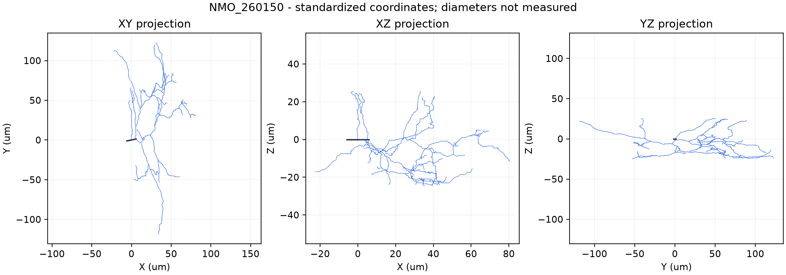
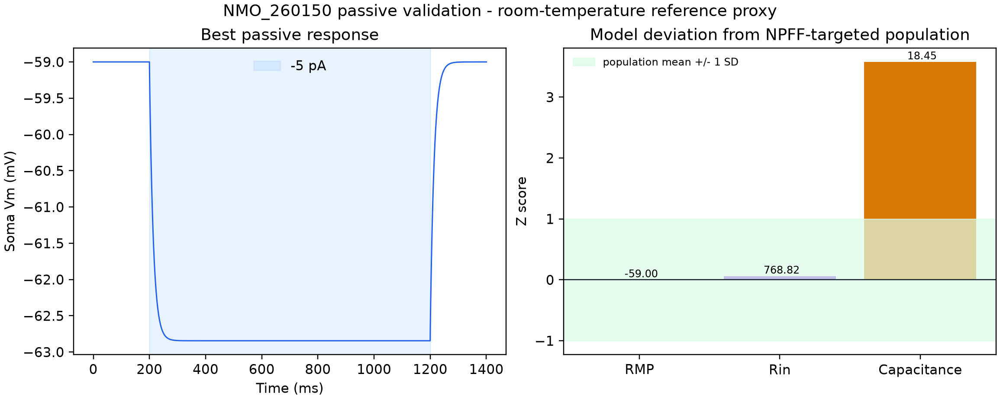
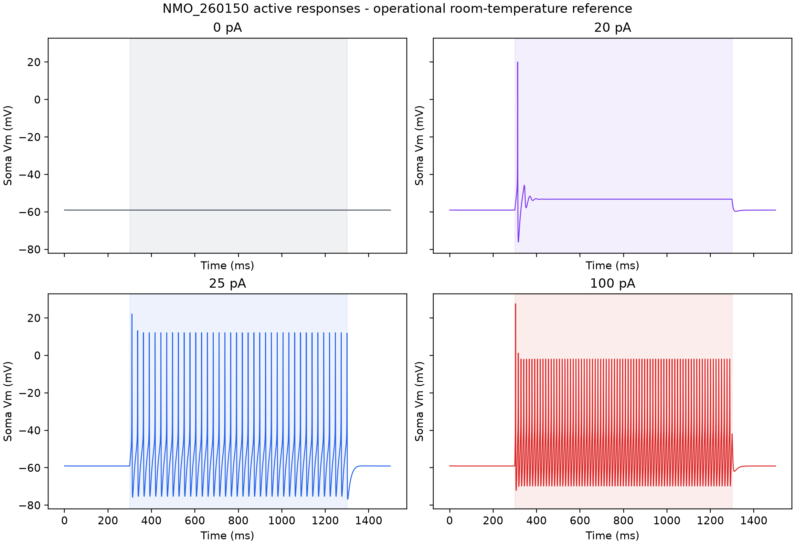
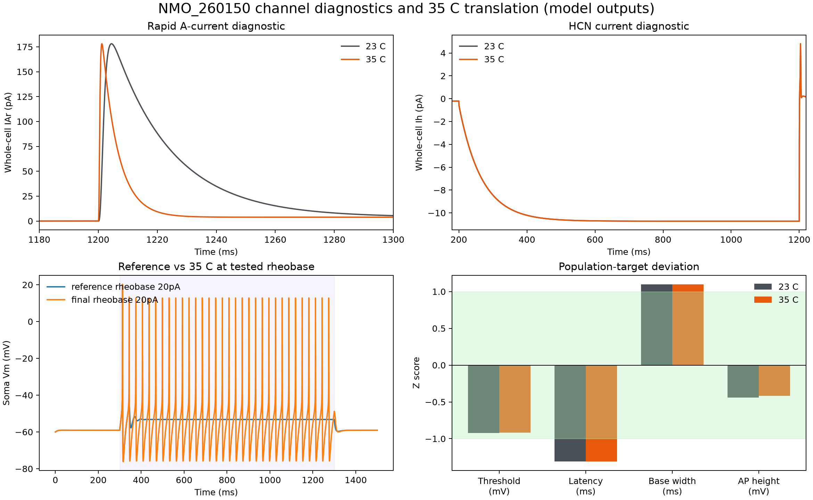
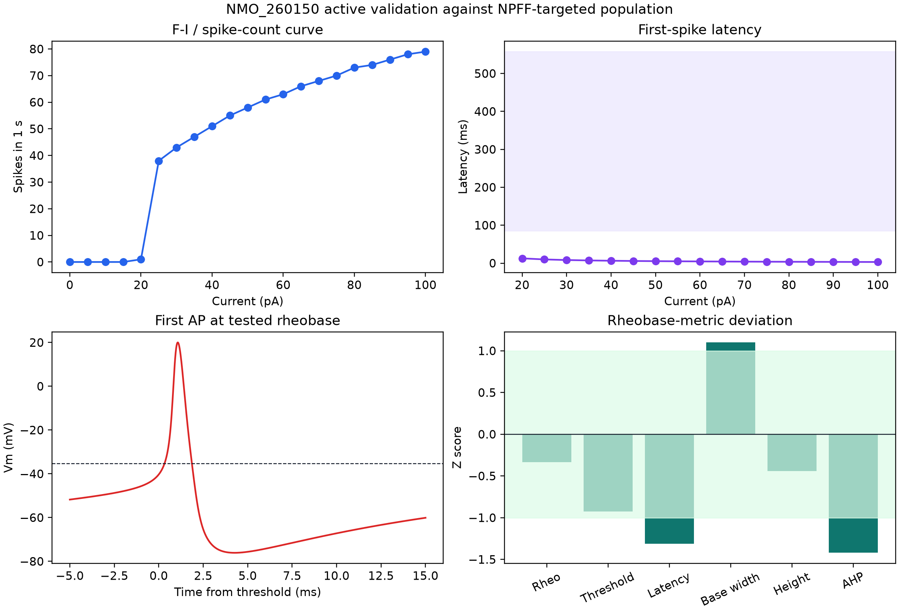

# NMO_260150 NPFF eCR-like interneuron model

**Complete morphology, mechanism, fitting, temperature, and readiness report**

Cell: 100521A-S14_set5_cell11

NeuroMorpho ID: NMO_260150

Final simulation temperature: 35 C

Status: PARTIAL - quantitatively constrained tonic model; capacitance and delayed-latency targets are not met
Date: 20 August 2026

> Evidence boundary: this is an NPFF-positive excitatory vertical-cell morphology used as a biologically informed eCR-like computational analogue. CR/calretinin identity is unconfirmed. Electrophysiology constraints come from an NPFFCre-targeted / GRPRFlp-excluded population, not this exact reconstructed neuron. The 35 C outputs are model predictions.

## 1. Executive summary

This work delivers one portable, deterministic NEURON model for NMO_260150 in the required `cells/eCR` boundary. The exact NeuroMorpho morphology passes topology QA and is represented without an axon or synthetic AIS. Four active mechanisms are retained after staged, bounded testing: fast Na, delayed-rectifier K, a rapid A-current representation, and HCN/Ih. No slow IA, T-type Ca, Ca/KCa, synaptic, TRPV1, or Y1 mechanism is added.

At 35 C the model predicts RMP -59.06 mV, current-step Rin 664.99 MOhm, rheobase 20 pA, threshold -40.25 mV, latency 12.62 ms, base width 1.95 ms, AP height 60.54 mV, and AHP -35.87 mV. The one-minute baseline is silent, post-step recovery passes, and no depolarization block appears at 100 pA. Rheobase, RMP, Rin, threshold, and AP height lie within one experimental SD. The final firing class is tonic, a phenotype observed in 8/26 measured cells. The delayed target fails, AP width and AHP are partial/outside-one-SD comparisons, and modeled capacitance remains 18.45 pF versus 10.58 +/- 2.2 pF.

The result is scientifically useful as a traceable intrinsic-cell prediction, but it is not ready for population/network deployment under the project gate. Passive capacitance and active delay limitations remain, there is no reconstructed axon, and synapse unit tests have not begun.

## 2. Exact NMO_260150 identity

The exact record is NMO_260150, depositor cell 100521A-S14_set5_cell11, from the Todd archive. NeuroMorpho identifies it as an adult mouse spinal-cord interneuron in superficial dorsal horn laminae I-II: excitatory, vertical, and NPFF-positive. The reconstructed domains are soma and dendrites. No axon is supplied.

The appropriate biological statement is: **NPFF-positive superficial dorsal-horn excitatory vertical interneuron used as a biologically informed analogue of the Medlock eCR population.** The model does not establish any missing molecular marker, channel expression profile, or electrophysiological phenotype for this individual cell.

## 3. Why eCR-like is only a computational mapping

Medlock eCR is a network-role label associated with excitatory calretinin circuitry. NMO_260150 has a vertical excitatory NPFF identity that supports an analogous superficial-dorsal-horn excitatory role, but the source record does not experimentally demonstrate CR/calretinin positivity. “eCR-like” is therefore a functional/network mapping, not a biological reclassification. No report, parameter file, or result calls the exact cell a CR neuron.

## 4. Morphology provenance

The untouched depositor original is a Neurolucida DAT file, checksum `D8387F...B684`. NeuroMorpho's standardized CNG SWC, checksum `AC078E...F7F7F`, is the simulation morphology. The two are stored separately and explicitly labeled; the derived SWC is never described as the depositor original. Exact API metadata are stored alongside the files.

The primary record is linked to Quillet et al. 2023 (PMID 37041197; DOI 10.1038/s41598-023-32720-3). The morphology source and all transformations are described in `evidence/morphology_provenance.md`.

## 5. Morphology QA

The standardized file has 1,297 valid rows: 3 soma nodes and 1,294 dendrite nodes. It has one root, one connected component, 32 branch points, 33 dendritic endpoints, 1,331.73 um dendritic cable, and a maximum root-path distance of 171.63 um. Coordinate extents are 102.85 um in X, 241.40 um in Y, and 49.99 um in Z.

QA found zero orphan nodes, duplicate-coordinate groups, zero-length segments, nonpositive radii, or axon nodes. NEURON instantiation produces one soma plus 64 maximal-unbranched dendritic sections, 65 sections total, and 115 segments under the nominal d-lambda rule. Figure 1 is an original QA projection of the standardized coordinates.



## 6. Vertical-cell evidence from 30 pro-NPFF-confirmed reconstructions

The paper's morphology population is unusually strong for NPFF identity: 30 Brainbow-labelled cells were also pro-NPFF-immunoreactive. Virtually all corresponded to vertical cells, and every reconstruction had greater ventrally directed than dorsally directed dendritic length. Fourteen of 30 somata were less than 20 um below dorsal white matter and were likely in lamina I; the remainder included lamina II. The authors use “vertical cells” across both laminae.

This evidence supports the vertical-cell interpretation of the NMO record. It does not supply exact-cell passive or active electrophysiology.

## 7. Dendritic orientation

NeuroMorpho metadata classify NMO_260150 as vertical. The population paper establishes the characteristic ventral bias. The standardized CNG coordinate plot has a long principal axis, but its display orientation is not used to re-derive anatomical dorsal/ventral direction because preprocessing can change coordinate frames. Anatomical orientation claims therefore come from source metadata and the paper, while the plotted extents are treated as geometric QA.

## 8. Spine density

The pro-NPFF-confirmed morphology population had 30.7 +/- 3.7 spines per 100 um of dendrite, compared with 15.9 +/- 5.1 in GRPR cells. This feature strengthens the distinction between the populations and is recorded for future synapse placement. The present cable model does not instantiate explicit spines, so the value is evidence metadata rather than an intrinsic-fit parameter.

## 9. Axon/diameter limitations

The actual morphology contains no axon nodes. The final model therefore has **NO RECONSTRUCTED AXON**. Native soma+dendrite conductances generate stable APs without a synthetic AIS, so no model-defined AIS is added.

NeuroMorpho marks the record `No Diameter`. Although the standardized SWC contains radii, they are interpreted as a standardized/model-defined profile rather than measured anatomy. The nominal profile is fixed during fitting. Only global 0.8x and 1.2x sensitivity cases are tested. This is the main structural limitation and the reason capacitance is compared rather than forced.

## 10. Critical electrophysiology sampling design

The electrophysiology cohort is not the same evidence class as the pro-NPFF-confirmed reconstruction cohort. It used NPFFCre;GRPRFlp mice with Cre-dependent GFP and Flp-dependent mCherry, then targeted GFP-positive/mCherry-negative cells. These recordings are categorized throughout as **NPFFCre-targeted / GRPRFlp-excluded population-level evidence**.

They constrain a plausible population member. They do not prove that NMO_260150 had the fitted conductance densities or firing pattern.

## 11. Why patched “NPFF cells” were not individually pro-NPFF-confirmed

The paper explicitly states that GFP-positive/mCherry-negative cells are called NPFF cells “for convenience” in the electrophysiological experiments. Individual patched cells were not post hoc confirmed as pro-NPFF-positive. The distinction prevents an exact-cell claim from being inferred from a genetic targeting strategy. It appears in the README, evidence matrix, parameter metadata, results, and report.

## 12. Passive electrophysiology

Reported population targets are RMP -59.0 +/- 8.2 mV, Rin approximately 750 +/- 307 MOhm, and whole-cell capacitance 10.58 +/- 2.2 pF. The paper first assessed spontaneous activity for one minute at resting potential. RMP was derived from an I-V relationship using 100 ms voltage steps from -70 to -50 mV in 2.5 mV increments. Rin used five 1 s, -5 mV steps from -70 mV. Cells more depolarized than -30 mV were excluded.

These source protocols are preserved even where the computational measurement differs. The model's Rin check uses a small current step, which is labeled rather than passed off as the paper's voltage-clamp method.

## 13. Passive fitting

The bounded passive search evaluated 128 coarse and 30 local candidates. Diameter was fixed. The selected uniform parameters are Ra 225 ohm cm, cm 0.5 uF/cm2, g_pas 3.6e-5 S/cm2, and e_pas -59 mV. The passive-only reference produces RMP -59.0 mV, Rin 768.82 MOhm, tau 13.625 ms, and modeled whole-cell capacitance 18.45 pF.

RMP and Rin meet their priorities. Capacitance is 7.87 pF high, or 3.58 SD above the population mean. The mismatch is deliberately retained: cm was not reduced below 0.5 uF/cm2, and an unmeasured diameter was not tuned to manufacture agreement.



## 14. Firing pattern distribution

Among 26 targeted cells, 11/26 (42.3%) were delayed, 8/26 (30.8%) tonic, 5/26 (19.2%) transient, and 2/26 (7.7%) single-spike. Delayed is the largest category but not a majority. It was the first phenotype attempted because of its frequency and its closer eCR mapping. Tonic remained an acceptable alternative when more realistic conductance constraints did not produce a long delay.

## 15. Figure 9 experimental logic

The model reproduces the protocol logic, not the copyrighted figure: 1 s suprathreshold somatic current injections, 5 pA increments near rheobase, a pre-step baseline, and post-step recovery. All plots are original NEURON outputs. Under the operational room-temperature reference, the 20 pA step gives one onset spike and 25 pA is tonic. At 35 C, the 20 pA step is tonic because B_A kinetics accelerate.



## 16. Rheobase

Paper target: 26.9 +/- 20.5 pA (n=26). The exact 5 pA scan gives 20 pA at both the operational 23 C reference and 35 C. The 35 C prediction is -0.34 SD from the population mean and passes the one-SD comparison.

## 17. Threshold

The paper defines threshold by dV/dt > 10 mV/ms and reports -35.3 +/- 5.4 mV. The runner finds the last upward derivative crossing before the first AP and predicts -40.25 mV at 35 C. This is -0.92 SD from the mean and passes the one-SD comparison.

## 18. First-spike latency

The target is 321.8 +/- 235.8 ms at rheobase. The final prediction is 12.62 ms, 1.31 SD below the mean and far below the delayed qualitative target. This is a **FAIL**. No artificial capacitance, weak sodium, extreme AIS coupling, or unsupported slow current was introduced to create delay.

## 19. AP base width

The experimental value is a base width, 1.4 +/- 0.5 ms, not half-width. The implemented measurement runs from the dV/dt-defined threshold time to the first downstroke crossing of the same threshold voltage. The final value is 1.95 ms, 1.10 SD high, classified as PARTIAL.

## 20. AP height

The experimental definition is peak minus threshold, with target 64.8 +/- 10.2 mV. The model uses the same definition and predicts 60.54 mV at 35 C, -0.42 SD from the mean. It passes.

## 21. AHP

The source reports -28.42 +/- 5.2 mV using its threshold-relative convention. The model measures the minimum within 50 ms after the threshold down-crossing and subtracts threshold. The result is -35.87 mV, 1.43 SD more negative. This comparison fails the one-SD band and is retained without adding unsupported Ca/KCa mechanisms.

## 22. Spontaneous firing

Fourteen of 25 targeted cells (56%) were spontaneously active during a one-minute baseline; mean population frequency was 0.7 +/- 0.8 Hz. The final model produces zero spikes in 60 s at zero current. This is a biologically plausible silent member of the 44% non-spontaneous subset and avoids pathological high-frequency spontaneous firing.

## 23. Rapid IA

Rapid A-current was observed in 10/16 cells (62.5%) with peak amplitude 165.7 +/- 80.3 pA. `B_A` was tested as a model representation, not assumed to be the molecular current in NMO_260150. A soma-restricted density of 0.005 S/cm2 yields 178.07 pA at 35 C under the -60/-90/-40 mV protocol, within one SD. Its source Q10=3 accelerates kinetics at 35 C, while peak amplitude stays similar.

## 24. Slow IA

Slow IA occurred in 4/16 cells (25%) with 333.0 +/- 184.1 pA. A separate slow-current mechanism was not retained because the rapid IA/HCN configuration already provided a stable, quantitatively stronger model and no credible need justified added complexity. The absence is an evidence-based parsimony choice, not a claim that NMO_260150 lacked slow IA.

## 25. Ih

Ih was the most common specifically identified current, present in 11/16 cells (68.8%) at -10.9 +/- 5.0 pA. A published Kole-derived HCN mechanism was tested uniformly and retained at 5.7e-5 S/cm2, giving -10.72 pA. The channel's original cortical provenance is explicit; its density is fitted, and exact-cell expression remains unknown.

## 26. Absence of ICaT

T-type calcium current was detected in 0/16 tested cells. It is therefore excluded from the default model despite availability in broader Medlock mechanism collections. Adding it would require new independent evidence.

## 27. Channels tested

Staging followed the requested order: MODEL 0 passive only; MODEL 1 passive + B_Na + B_DR; MODEL 2 + B_A; MODEL 3 + Ih_Kole. The active fit executed 145 simulations, below the 500-simulation ceiling. A broad mechanism hunt or giant parameter sweep was not performed.

## 28. Channels retained

The final conductance densities are:

| Mechanism | Soma (S/cm2) | Dendrite (S/cm2) | Final role |
|---|---:|---:|---|
| B_Na | 0.12 | 0.0048 | AP initiation/upstroke in native soma+dendrite model |
| B_DR | 0.30 | 0.030 | repolarization and stable repetitive firing |
| B_A | 0.005 | 0 | rapid IA representation and channel-amplitude constraint |
| Ih_Kole | 5.7e-5 | 5.7e-5 | HCN/Ih amplitude and subthreshold constraint |

All densities are fitted assumptions. No density is presented as an experimental measurement from this exact cell.

## 29. Channels rejected

Slow IA was not needed and has lower prevalence. T-type Ca was absent experimentally. Ca/KCa was not required by recovery or depolarization-block tests. Synaptic, TRPV1-afferent, and Y1-receptor effects belong to future network/neuromodulation work. A synthetic AIS was unnecessary. This restrained complement is the largest defensible set, not the largest available set.

## 30. Mechanistic explanation of delayed firing

A-type K current can oppose early depolarization and thereby extend first-spike latency when its voltage dependence, recovery, inactivation, density, and localization align with the cell. Here, B_A produces a paper-scale IAr peak but the chosen kinetics and soma-only density do not sustain hundreds of milliseconds of delay. At 23 C, 20 pA yields one onset spike; at 25 pA the model becomes tonic. At 35 C, the B_A Q10 shortens gating time constants and the 20 pA response becomes tonic.

The B_A +/-10% robustness cases keep 20 pA rheobase and tonic classification. Therefore rapid IA is present and measurable, but it does not mechanistically support the delayed phenotype in this model. The honest result is a failed delayed target, not a relabeled onset response.

## 31. Synaptic evidence

The paper reports sEPSCs at 6.86 +/- 6.15 Hz and 34.3 +/- 6.3 pA (n=27), and mEPSCs at 2.35 +/- 1.99 Hz and 30.1 +/- 4.1 pA (n=15). These values are stored for future synapse parameterization but are not mixed into isolated-cell fitting. No spontaneous synaptic bombardment is applied.

## 32. TRPV1 input evidence

Four of seven tested cells were capsaicin-sensitive. In sensitive cells, mEPSC frequency rose from 1.5 +/- 0.7 to 3.8 +/- 2.7 Hz, supporting monosynaptic input from TRPV1-expressing primary afferents to some NPFF cells. This is future network evidence and is not implemented as an intrinsic conductance.

## 33. Y1 receptor evidence

All six tested cells responded to [Leu32,Pro34]-NPY with outward current; maximum current was 27.8 +/- 8.8 pA. Rin decreased from 533.5 +/- 223.5 to 342.3 +/- 95.0 MOhm. The result supports functional Y1 receptors in the sampled population. No Y1 mechanism is included because the present target is an unmodulated baseline intrinsic cell.

## 34. Experimental recording conditions

The paper describes room-temperature preparation/recording context, with a 32 C recovery period. A numerical recording-chamber temperature is not reported. The 23 C model used during fitting is therefore an operational room-temperature proxy rather than an experimentally measured chamber value. Any numerical comparison to the paper is population-level and reference-condition constrained.

## 35. 35 C translation

Each final MOD file was audited independently before setting `h.celsius=35` before `finitialize`. B_A applies Q10=3 relative to 23 C to its time constants. B_Na and B_DR declare a `tadj` expression but do not apply it to their kinetics; Ih_Kole has no temperature term. No universal Q10 is imposed and no mechanism is double-scaled.

The final 35 C result is a **temperature-translated model prediction constrained by room-temperature NPFF-targeted population electrophysiology**. It is never described as directly validated at 35 C. The main observed change is faster A-current decay and tonic firing at the tested rheobase.



## 36. Numerical robustness

Thirteen deterministic cases were evaluated at 35 C. Halving dt from 0.025 to 0.0125 ms and tightening d-lambda from 0.1 to 0.05 left rheobase at 20 pA and the rheobase class tonic. Every conductance +/-10% case remained excitable, recovered after 100 pA, and avoided depolarization block. Rheobase changed by at most -5 pA; no tested case shifted it upward or outside the experimental one-SD interval.

The current scan, measurement definitions, and strong-current safety step are identical across variants. Detailed per-case metrics are in `results/robustness.json`.

## 37. Diameter/AIS sensitivity

Global diameter -20% changed rheobase from 20 to 15 pA and remained tonic. Diameter +20% kept rheobase at 20 pA but yielded a single response at rheobase; the 100 pA safety response still recovered without block. This phenotype sensitivity reinforces that the radius profile is a model uncertainty.

AIS sensitivity is not applicable: the exact morphology contains no axon, and the model requires no synthetic AIS. Inventing short/long AIS cases would test a structure that is absent from the final model and would not be a local sensitivity analysis.

## 38. Comparison with NPFF experimental population

At 35 C, RMP, Rin, rheobase, threshold, AP height, IAr, and Ih fall within one reported SD. The model is silent at baseline, which is consistent with 11/25 recorded cells showing no spontaneous AP during the minute. Tonic firing is a reported 30.8% phenotype. AP base width is 1.10 SD high; latency is 1.31 SD low; AHP is 1.43 SD more negative; capacitance is 3.58 SD high.

These comparisons are descriptive constraints across different source sample sizes, not a claim that all metrics co-occurred in one biological neuron or that the 35 C simulation recreates a 35 C experiment.



## 39. Comparison with Medlock eCR

The model shares a superficial excitatory role and reuses audited Medlock-starting Na/K mechanisms. It does not inherit Medlock conductance densities, cell identity, morphology, or full channel complement. eCR-like captures intended network placement; the final tonic phenotype is less close to a delayed eCR abstraction and must be accounted for before network use.

## 40. Limitations

Major limitations are: no measured diameters; no reconstructed axon; no exact-cell electrophysiology; genetic-targeting rather than individual pro-NPFF confirmation for the electrophysiology cohort; unknown exact-cell channel expression and distribution; a cortical-source HCN mechanism; a simplified soma representation; current-step rather than source voltage-step Rin measurement in the final active probe; capacitance mismatch; absent long delay; and incomplete AHP/base-width agreement.

The model has no spines, synapses, primary-afferent input, neuromodulation, ion-concentration dynamics, stochastic channels, or population heterogeneity. Its deterministic stability is an implementation property, not evidence that biological variability is negligible.

## 41. Network readiness

**NETWORK READY: NO.** Morphology QA and passive/active intrinsic testing are complete, but the project build order requires successful gates before population integration. The capacitance and delayed-latency targets remain unresolved, no axon is available, and synapse unit tests have not been performed. The cell can be used for isolated exploratory work with explicit limitations, not as a validated population template.

## 42. Reproduction command

From the root of either destination repository, with NEURON 9.x and `nrnivmodl` available:

```bash
python cells/eCR/scripts/run_eCR_final.py --dry-run
python cells/eCR/scripts/run_eCR_final.py
```

The runner compiles portable MOD sources to a hash-keyed operating-system temporary directory, loads the exact standardized morphology, applies JSON-controlled parameters, sets 35 C before initialization, runs the minute baseline and current/channel protocols, performs robustness checks, and overwrites structured results and the fifth figure deterministically. No platform binary or cache is required in Git.

## 43. References

1. Quillet R, et al. Characterisation of NPFF-expressing neurons in the superficial dorsal horn of the mouse spinal cord. *Scientific Reports*. 2023;13:5891. https://doi.org/10.1038/s41598-023-32720-3.
2. NeuroMorpho.Org. NMO_260150 metadata and standardized reconstruction. https://neuromorpho.org/api/neuron/id/260150.
3. Medlock L, et al. ModelDB accession 267056; source of candidate dorsal-horn Na, delayed-rectifier K, and A-type K mechanisms. https://modeldb.science/267056.
4. Kole MHP, Hallermann S, Stuart GJ. Single Ih channels in pyramidal neuron dendrites: properties, distribution, and impact on action potential output. *Journal of Neuroscience*. 2006;26(6):1677-1687. https://doi.org/10.1523/JNEUROSCI.3664-05.2006.
5. ModelDB accession 149100; source archive for the Kole-derived HCN candidate. https://modeldb.science/149100.
