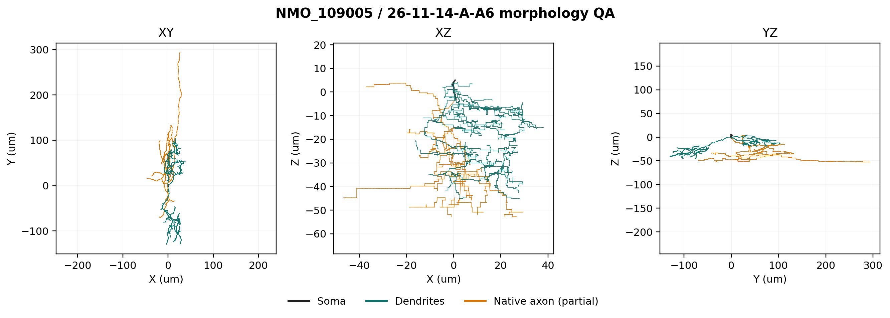
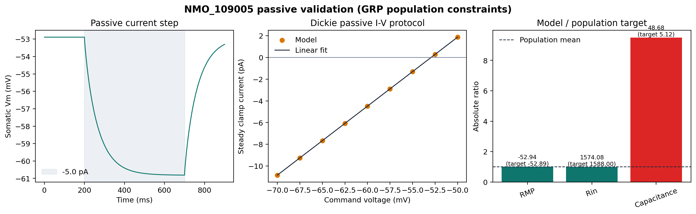
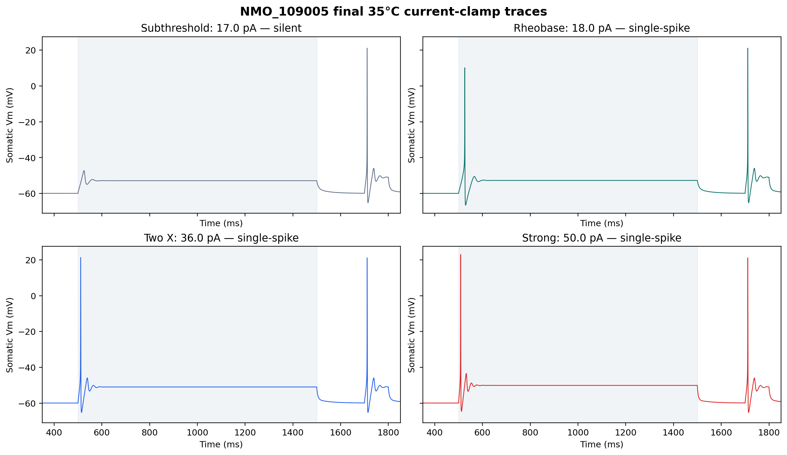
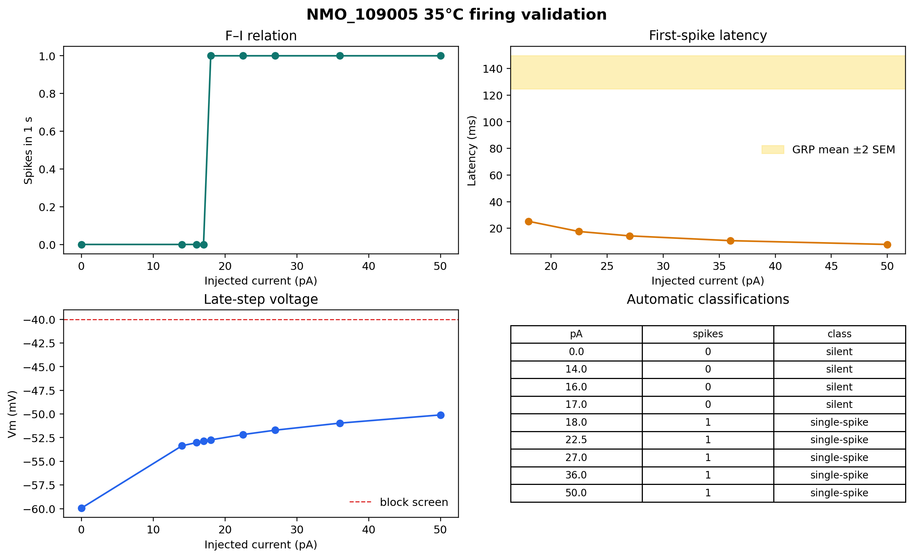
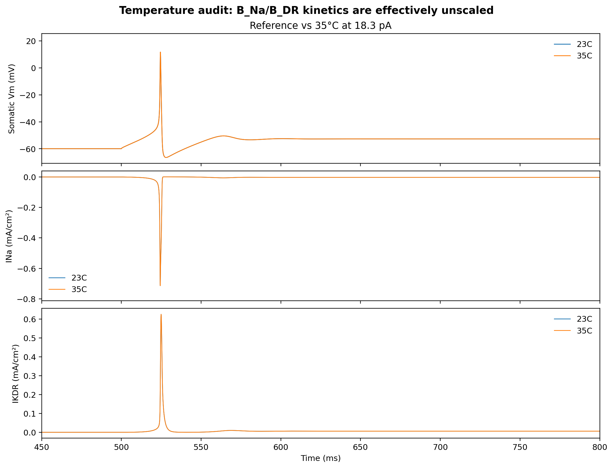

# NMO_109005 GRP excitatory interneuron

## Complete eTrC-like model report

**Cell:** 26-11-14-A-A6  
**NeuroMorpho ID:** NMO_109005  
**Project condition:** 35°C  
**Decision:** **ENGINEERING READY / BIOLOGICALLY PROVISIONAL**  
**Ready for network integration:** **NO**

## 1. Biological identity

NMO_109005 is a reconstructed mouse GRP-positive excitatory interneuron from lamina II of the mid-lumbar spinal dorsal horn. The reconstruction is used here as a **GRP-positive lamina-II excitatory interneuron used as a biologically informed transient-central/eTrC-like model**.

## 2. Why this morphology is suitable for eTrC-like modelling

Dickie et al. showed that GRP cells are excitatory interneurons, many have central-like somatodendritic morphology, and most recorded GRP cells fired transiently or with a single spike. That evidence supports an eTrC-like computational interpretation at the population level. The NMO_109005 record provides soma, dendrites, and a native partial/moderate axon without requiring invented dendritic geometry.

## 3. Critical identity warning

GRP does not uniquely imply eTrC, and NMO_109005 itself has not been experimentally assigned to a molecular class called “eTrC.” Its exact electrophysiological recording is not publicly linked to the morphology. All Dickie quantitative constraints below are GRP population values rather than same-cell targets.

## 4. Morphology QA

The existing SWC was retained byte-for-byte (SHA-256 `3f74c3796e9992b63dabb4f9c8430695658f35bd03f824bb47a58ce1c625726e`). It contains 10,314 valid records in one connected component: 9 soma, 7,056 dendrite, and 3,249 axon nodes. Soma, dendrites, and axon are present; there are no orphan parents, non-positive radii, zero-length edges, or invalid rows. Approximate cable length is 3,291.95 µm, with 83 branch points and 87 endpoints. The native axon is treated as partial/moderate, consistent with the NeuroMorpho physical-integrity record.



## 5. Dickie experimental evidence

Dickie et al. reported data as mean ± SEM unless otherwise stated. Key GRP values are RMP −52.89 ± 0.78 mV (n=230), Rin 1,588 ± 85 MΩ (n=232), whole-cell capacitance 5.12 ± 0.11 pF (n=232), rheobase 18.30 ± 1.07 pA (n=155), and first-spike latency at rheobase 137.1 ± 6.2 ms (n=155). Firing classes were transient 49.5%, single 32.9%, tonic 8.3%, reluctant 6.5%, and delayed 2.8% (n=216).

The paper also reported IAr in 40.9%, Ih in 37.3%, IAs in 25.8%, and ICaT in 33.3% of tested GRP cells. Prevalence in a population does not prove that any one current is present in NMO_109005.

## 6. Passive targets and acceptance rule

RMP and Rin were fitted using the paper's −60 mV voltage-clamp logic: 100 ms steps from −70 to −50 mV in 2.5 mV increments. A model value within the population mean ±2 SEM was counted as a comparison pass. This is a transparent engineering criterion, not a same-cell biological interval.

## 7. Passive parameters and result

| Parameter | Final value | Basis |
|---|---:|---|
| Ra | 100 Ω·cm | bounded fit |
| cm | 0.7 µF/cm² | plausible bounded fit |
| g_pas | 1.0×10⁻⁵ S/cm² | bounded fit |
| e_pas | −52.89 mV | population constraint |
| d-lambda | 0.1 at 100 Hz | numerical policy |

The passive model produced RMP −52.940 mV and Rin 1,574.08 MΩ: both pass the declared ±2 SEM comparison. Morphology-derived capacitance was 48.68 pF and fails the 5.12 pF population value. This mismatch was preserved because forcing it would require an implausibly small specific membrane capacitance.



## 8. Active firing distribution target

The primary target was transient firing and the declared secondary acceptable phenotype was single-spike firing. Automatic classes were based on spike times, late-step voltage, recovery voltage, and response to a later test pulse. A brief response followed by sustained depolarization or failed recovery was classified as depolarization block rather than transient firing.

## 9. Rheobase and first-spike latency

At 35°C, a −5.3 pA holding current maintained the soma near −60 mV. On the declared current grid, 17 pA was silent and 18 pA produced one spike, giving a rheobase of **18 pA** (pass versus 18.30 ± 1.07 pA). First-spike latency was **25.25 ms** (fail versus 137.1 ± 6.2 ms). The latency mismatch was not hidden by adding unsupported conductances.

## 10. Channel evidence

Fast Na and delayed-rectifier K currents are mechanistically necessary for AP initiation and repolarization. Their densities are fitted model parameters, not measurements from NMO_109005. Rapid A-current had direct population-level prevalence evidence, while KCa was only a Medlock-supported comparator. HCN, T-type Ca, and a distinct slow A-current were not tested because appropriate audited mechanisms or a validated observable requiring them were absent.

## 11. Channels tested

- Model A: `pas + B_Na + B_DR`.
- Model B: Model A plus `B_A` at restrained somatodendritic densities.
- HH2 basic-spiking comparator.
- Paired `iCaL + CaIntraCellDyn + iKCa` comparator.
- HCN, T-type Ca, and a distinct slow A-current: not tested, with reasons recorded in `active_validation.json`.

## 12. Channels retained

The final complement is `pas`, `B_Na`, and `B_DR`. It is the largest channel set justified by both evidence and necessity in this task; additional tested channels did not improve the constrained phenotype.

## 13. Channels rejected

`B_A` shifted rest negative and raised rheobase at restrained densities, while larger values silenced the model; it did not recover the long latency. HH2 produced tonic firing at useful densities, and high-K apparent single-spike regimes were depolarization block. The Ca/KCa comparator reduced firing but did not produce a necessary stable transient, so its complexity was rejected. `iCaL` is L-type and was never treated as evidence for ICaT.

## 14. Reason for every final channel

- `pas`: defines the fitted subthreshold membrane response.
- `B_Na`: required for an overshooting action potential.
- `B_DR`: required for repolarization, stable late-step voltage, and recovery.

## 15. Final conductance table

| Mechanism | Soma | Model-defined proximal native axon | Elsewhere | Reversal |
|---|---:|---:|---:|---:|
| B_Na gnabar | 0.2 S/cm² | 0.4 S/cm² at path distance ≤20 µm | 0 | ENa = +53 mV |
| B_DR gkbar | 0.6 S/cm² | 1.2 S/cm² at path distance ≤20 µm | 0 | EK = −84 mV |

The active domain is explicitly **MODEL-DEFINED**. It changes channel distribution only; no synthetic AIS or other geometry was added to the native partial axon.

## 16. Representative traces

The 17 pA trace is subthreshold. Rheobase, 2× rheobase, and the 50 pA strong condition each produce one onset spike. Every panel includes the later 36 pA recovery pulse.



## 17. Evidence against depolarization block

At rheobase, the late-step Vm was −52.73 mV, the AP peak was +10.18 mV, voltage returned within 3 mV of the pre-step value, and the later test pulse elicited another spike. No current in the 0–50 pA final series met the automatic depolarization-block rule. The single-spike phenotype is therefore a stable cessation of firing, not failed recovery at a strongly depolarized voltage.



## 18. Translation to 35°C

`h.celsius` is set to 35 before initialization. Source audit found that `B_Na` computes a Q10=3 `tadj` relative to 23°C but uses `tau_factor`, not `tadj`, in gate tau; `B_DR` computes `tadj` and never applies it. With tables disabled, 23°C and 35°C traces are numerically identical. The accurate statement is therefore: **35°C project-condition model constrained by room-temperature GRP population data, with retained channel kinetics effectively temperature-independent**. This is a material limitation, not evidence of a validated physiological temperature translation.



## 19. Numerical robustness

Halving dt from 0.025 to 0.0125 ms and tightening d-lambda from 0.1 to 0.05 left rheobase at 18 pA, the single-spike phenotype intact, and metrics nearly unchanged. Independent ±10% channel tests preserved a non-blocking single-spike/transient-compatible rheobase response and recovery. Rheobase ranged from 16 to 22 pA; Na −10% moved it 4 pA above baseline, so robustness is **PARTIAL**, not PASS.

## 20. Known limitations

- No same-cell physiology is linked to NMO_109005.
- GRP identity does not uniquely establish eTrC membership.
- Whole-cell capacitance is incompatible with the full reconstructed area under plausible cm.
- The final active model has natural RMP −55.67 mV and Rin 464.24 MΩ; active Rin fails the GRP population target and active RMP falls outside mean ±2 SEM.
- First-spike latency is much too short.
- The 20 µm active domain is model-defined rather than reconstructed AIS anatomy.
- Retained B_Na/B_DR kinetics are effectively temperature-independent.
- Synapses and network behavior were not tested; the mandated build order stops at failed single-cell gates.

## 21. Final readiness decision

**ENGINEERING READY / BIOLOGICALLY PROVISIONAL.** The package is reproducible, self-contained, numerically stable, morphology-constrained, and honest about failures. It is **not ready for network integration** because active-model Rin and latency remain failed single-cell gates. Synapse unit tests and scaled-population tests should wait until those biological gaps are resolved with better-supported mechanisms or same-cell/closer-class data.

## 22. Exact reproduction command

From either target repository root in a Linux NEURON environment:

```bash
python cells/eTrc/scripts/run_eTrC_final.py
```

For the full staged audit and robustness set:

```bash
python cells/eTrc/scripts/fit_active.py
```

## References

1. Dickie AC et al. Morphological and functional properties distinguish the substance P and gastrin-releasing peptide subsets of excitatory interneuron in the spinal cord dorsal horn. *PAIN*. 2019;160:442–462. [DOI 10.1097/j.pain.0000000000001406](https://doi.org/10.1097/j.pain.0000000000001406); [PMCID PMC6330098](https://pmc.ncbi.nlm.nih.gov/articles/PMC6330098/).
2. NeuroMorpho.Org. [26-11-14-A-A6 / NMO_109005](https://neuromorpho.org/neuron_info.jsp?neuron_name=26-11-14-A-A6).
3. ModelDB 267056. [Medlock dorsal-horn model mechanism source](https://modeldb.science/267056).

The machine-readable evidence matrix is `../evidence/evidence_matrix.csv`; detailed protocol metrics are in `../results/`.

